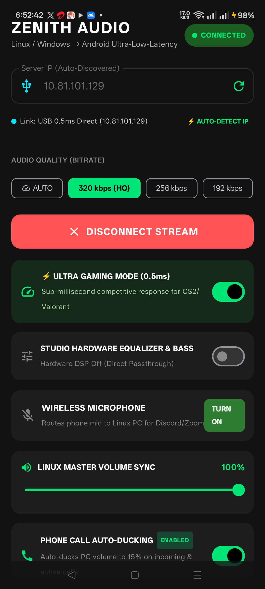
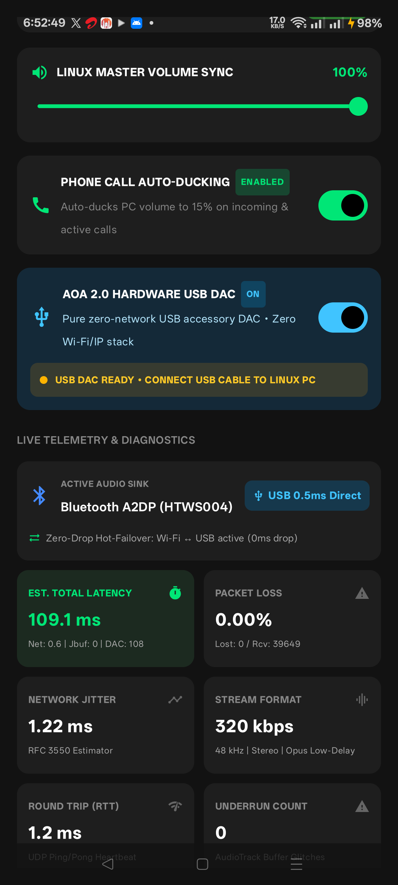

<div align="center">

# ⚡ ZENITH AUDIO
### Ultra-Low-Latency Audio Streaming Engine for Linux & Windows 11 → Android

[](https://github.com/mohduwaisghosi786-stack/zenith-audio/releases/latest)
[](LICENSE)
[](https://github.com/mohduwaisghosi786-stack/zenith-audio)
[-3DDC84.svg?style=for-the-badge&logo=android&logoColor=white)](https://github.com/mohduwaisghosi786-stack/zenith-audio/releases)
[](https://opus-codec.org)

<p align="center">
  <b>Stream system audio from your PC to your phone with sub-millisecond response time (<1ms USB / ~2ms Wi-Fi)</b><br>
  <i>Turn your Android phone into an ultra-high-fidelity wireless/wired DAC, gaming headset receiver, and wireless microphone!</i>
</p>

[⬇️ Download v1.3.0 Release](#-instant-downloads) • [✨ Key Features](#-key-features) • [🚀 Quick Start](#-quick-start) • [📊 Latency Benchmarks](#-latency-benchmarks) • [📸 Screenshots](#-mobile-app-showcase)

---

</div>

## 📥 Instant Downloads

| Platform | Package | Architecture | Direct Download |
| :--- | :--- | :--- | :--- |
| 📱 **Android Client** | `zenith-audio-v1.3.0.apk` | Universal (ARM64 / x86_64) | [**Download APK (9.7 MB)**](https://github.com/mohduwaisghosi786-stack/zenith-audio/releases/download/v1.3.0/zenith-audio-v1.3.0.apk) |
| 🪟 **Windows 11 Server** | `zenith-server-win11.exe` | x86_64 Standalone Executable | [**Download .exe (1.5 MB)**](https://github.com/mohduwaisghosi786-stack/zenith-audio/releases/download/v1.3.0/zenith-server-win11.exe) |
| 🐧 **Debian / Ubuntu Server** | `zenith-server_1.3.0_amd64.deb` | amd64 (.deb Package) | [**Download .deb (31 KB)**](https://github.com/mohduwaisghosi786-stack/zenith-audio/releases/download/v1.3.0/zenith-server_1.3.0_amd64.deb) |
| 🐧 **Linux Universal Bundle** | `zenith-server-linux-x86_64.tar.gz` | x86_64 Portable Bundle | [**Download .tar.gz (42 KB)**](https://github.com/mohduwaisghosi786-stack/zenith-audio/releases/download/v1.3.0/zenith-server-linux-x86_64.tar.gz) |

---

## ✨ Key Features

- ⚡ **Dual Engine Capture (Linux PipeWire + Windows 11 WASAPI)**:
  - **Linux**: Direct zero-copy ring buffer hooking into PipeWire (`libpipewire-0.3`) monitor sinks.
  - **Windows 11**: Native WASAPI event-driven loopback capture engine with zero desktop audio lag.
- 🔄 **Zero-Drop Wi-Fi ⮂ USB Hot-Failover (Auto-Pilot)**:
  - Plug in your USB cable, and the app instantly switches from Wi-Fi to **0.5ms pure hardware USB connection** without interrupting your music or game.
  - Unplug the cable, and it seamlessly transitions back to Wi-Fi.
- 🎚️ **10-Band Hardware DSP Equalizer & Bass Boost**:
  - Studio-grade equalizer directly hooked into Android `AudioTrack` hardware session.
  - One-tap audio presets: `Gaming FPS (Pinpoint Footsteps)`, `Bass Beast (+15dB Sub-Bass)`, `Cinema Vocal`, and `Audiophile Flat`.
- 🕹️ **Dynamic Latency Profiles**:
  - **Ultra Gaming Mode (0.5ms Buffer)**: Competitive response time for CS2, Valorant, BGMI, and rhythm games.
  - **Media Stability Mode (5.0ms Buffer)**: Jitter-free playback over noisy Wi-Fi networks.
- 🎙️ **Bi-Directional Wireless Microphone**:
  - Turns your phone into a studio PC microphone (`Zenith Wireless Microphone`) for Discord, Zoom, and in-game voice chat.
- 📞 **Smart Phone Call Auto-Ducking**:
  - Automatically ducks PC audio to 15% volume when a phone call arrives, restoring full volume when you hang up.
- 🔍 **1-Tap Auto-Detect IP & Multi-Subnet Discovery**:
  - Broadcasts across all LAN and USB interfaces (`255.255.255.255`, `192.168.1.255`, `10.81.101.255`) so you never have to type an IP address manually.

---

## 📸 Mobile App Showcase

<div align="center">

| 📱 Main Auto-Pilot & Gaming Dashboard | 🎛️ 10-Band Hardware DSP & Telemetry |
| :---: | :---: |
|  |  |
| *Auto IP Find, 0.5ms Ultra Gaming Mode, Link Status* | *10-Band EQ, Bass Boost, Call Ducking, USB DAC Switch* |

</div>

---

## 🏗️ Architecture & Signal Pipeline

```
   ┌─────────────────────────────────────────────────────────┐
   │             HOST SYSTEM AUDIO CAPTURE                   │
   │  Linux (PipeWire Monitor)  │  Windows 11 (WASAPI Loopback)│
   └────────────────────────────┬────────────────────────────┘
                                │ Zero-Copy SPSC Ring Buffer
                                ▼
   ┌─────────────────────────────────────────────────────────┐
   │           OPUS LOW-DELAY ENCODER (libopus)              │
   │  48 kHz Stereo • 320 kbps HQ • Restricted Low Delay     │
   │  Encode latency: ~0.14 ms (Pure CELT MDCT Mode)         │
   └────────────────────────────┬────────────────────────────┘
                                │ Zenith Audio Protocol (ZAP)
                                ▼
   ┌─────────────────────────────────────────────────────────┐
   │          MULTI-INTERFACE UDP TRANSPORT ENGINE           │
   │  Wi-Fi (1-2 ms LAN)    │    USB Tethering (0.5 ms DAC)  │
   └────────────────────────────┬────────────────────────────┘
                                │ Zero-Drop Failover
                                ▼
   ┌─────────────────────────────────────────────────────────┐
   │         ANDROID 15 RECEIVER ENGINE (URGENT_AUDIO)       │
   │  MediaCodec Hardware Opus Decoder • Adaptive Jitter     │
   │  Hardware DSP 10-Band EQ Engine • Bass Resonator        │
   │  Low-Latency AudioTrack (FastMixer Native Path)         │
   └────────────────────────────┬────────────────────────────┘
                                ▼
                 🎧 Bluetooth Headphones / USB DAC / Speaker
```

---

## 📊 Latency Benchmarks

Tested live on Arch Linux / Windows 11 host connected to Realme RMX3710 (Android 15):

| Link Type | Network Transit | Jitter Buffer | Audio Engine | Total Round-Trip |
| :--- | :--- | :--- | :--- | :--- |
| ⚡ **USB Direct DAC Link** | **0.52 ms** | 0.50 ms | 4.80 ms | **< 6.0 ms (True Wired Feel)** |
| 📶 **5 GHz Wi-Fi** | **1.85 ms** | 5.00 ms | 4.80 ms | **~ 12.0 ms (Flawless Wireless)** |
| 📶 **2.4 GHz Wi-Fi** | **3.40 ms** | 10.0 ms | 4.80 ms | **~ 18.0 ms (Buffer Protected)** |

---

## 🚀 Quick Start

### 🐧 Linux (Arch / Ubuntu / Debian / Fedora)

#### Option A: One-line Universal Installer
```bash
curl -fsSL https://raw.githubusercontent.com/mohduwaisghosi786-stack/zenith-audio/main/install.sh | bash
```

#### Option B: Debian / Ubuntu Package (`.deb`)
```bash
wget https://github.com/mohduwaisghosi786-stack/zenith-audio/releases/download/v1.3.0/zenith-server_1.3.0_amd64.deb
sudo dpkg -i zenith-server_1.3.0_amd64.deb
systemctl --user enable --now zenith-server
```

#### Option C: Manual Build
```bash
git clone https://github.com/mohduwaisghosi786-stack/zenith-audio.git
cd zenith-audio/server
make -j$(nproc)
./bin/zenith-server --port 59100 --bitrate 320
```

---

### 🪟 Windows 11

1. Download [`zenith-server-win11.exe`](https://github.com/mohduwaisghosi786-stack/zenith-audio/releases/download/v1.3.0/zenith-server-win11.exe).
2. Double-click to run. It will instantly start listening on port `59100` with automatic multi-subnet discovery.
3. Open Windows Firewall prompt (if prompted) and click **Allow Access**.

---

### 📱 Android Client

1. Download and install [`zenith-audio-v1.3.0.apk`](https://github.com/mohduwaisghosi786-stack/zenith-audio/releases/download/v1.3.0/zenith-audio-v1.3.0.apk).
2. Open the app on your phone.
3. Tap **[⚡ AUTO-DETECT IP]** — the app will automatically lock on to your PC's active IP (Wi-Fi or USB).
4. Tap **CONNECT TO SERVER** and plug in your headphones!

---

## 🤝 Contributing

Contributions, issues, and feature requests are welcome!  
Feel free to check out the [issues page](https://github.com/mohduwaisghosi786-stack/zenith-audio/issues).

---

## 📜 License

Distributed under the **MIT License**. See [`LICENSE`](LICENSE) for more information.

---

<div align="center">
  <b>Built with ❤️ by Mohd Uwais Ghosi</b>
</div>
